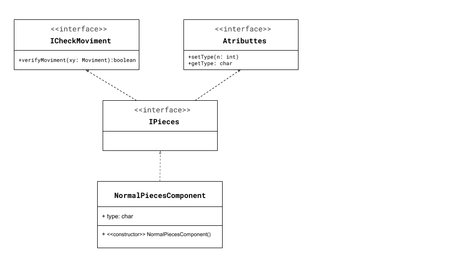
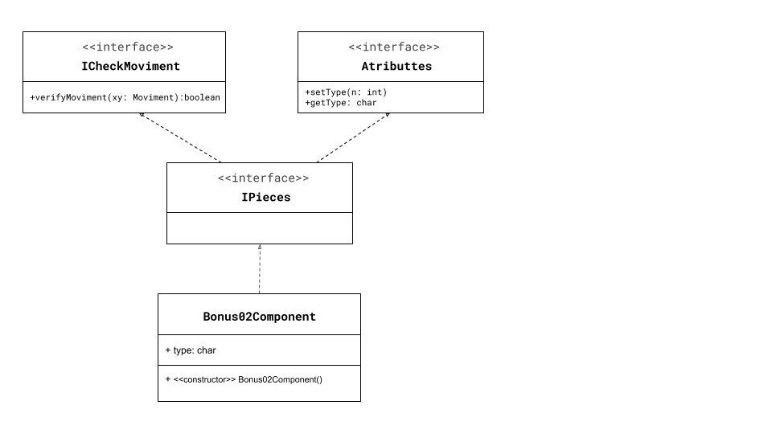
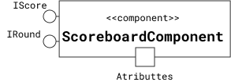
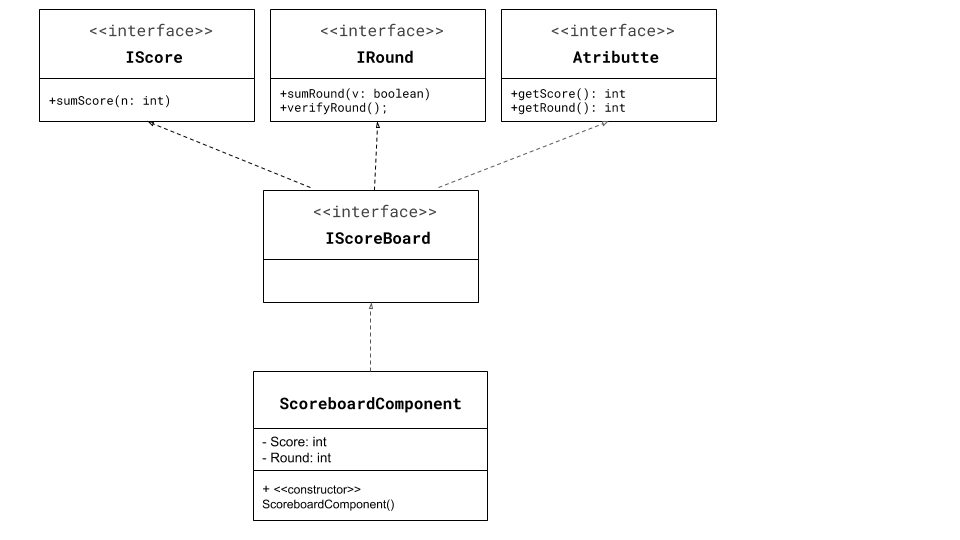

# Projeto Bitcrush

# Equipe
* Thaina Milene de Oliveira - 244570

# Descrição Resumida do Projeto
O BitCrush é um jogo que consiste em trocar duas peças de lugar no tabuleiro para criar combinações de 3 ou mais peças do mesmo tipo.

# Vídeo do Projeto
[Link do vídeo](https://drive.google.com/file/d/1cZREXR3dypyyvbGZF23Ii20eB0uwlEGt/view?usp=sharing)

# Diagrama Geral de Componentes

# Componente BoardComponent

## Interfaces

Interfaces associadas a esse componente:

Campo | Valor
----- | -----
Classe | `BitCrush.BoardComponent`
Autores | Thaina Milene de Oliveira
Objetivo | Criar e manipular o tabuleiro
Interface | IBoard
~~~
public interface IBoardManager {
  public void assembleBoard();
  public void printBoard(Scoreboard Component data);
}
public interface IPiecesManager {
  public void movePieces(MovimentComponent xy);
  public void transformsPieces(char type);
}
public interface IBoard extends IBoardManager, IPiecesManager {
}
~~~

## Detalhamento das Interfaces

### Interface IBoardManager
Interface para gerenciar as ações feitas no tabuleiro.

Método | Objetivo
-------| --------
assembleBoard | tem como objetivo montar um tabuleiro inicial com peças aleatórias
printBoard | recebe dados do ScoreboardComponent e tem como objetivo imprimir o tabuleiro e a pontuação e rodada atual

### Interface IPiecesManager
Interface para gerenciar as ações feitas pelo tabuleiro nas peças.

Método | Objetivo
-------| --------
movePieces | dado as coordenadas fornecidas pelo componente MovimentComponent, o tabuleiro trocará duas peças, se for um movimento válido
transformsPieces | recebe e transforma peças de um tipo normal, em um bonus

# Componente NormalPiecesComponent

## Interfaces

Interfaces associadas a esse componente:

Campo | Valor
----- | -----
Classe | `BitCrush.NormalPiecesComponents`
Autores | Thaina Milene de Oliveira
Objetivo | Criar peças normais e diversas
Interface | IPieces
~~~
public interface ICheckMoviment {
  public boolean verifyMoviment(Moviment:xy);
}
public interface Atributtes {
  public void setType(int n);
  public char getType();
}
public interface IPieces extends ICheckMoviment, Atributtes {
}
~~~

## Detalhamento das Interfaces

### Interface ICheckMoviment
Interface para verificar se o movimento proposto é válido

Método | Objetivo
-------| --------
verifyMoviment | verifica se o movimento fornecido pelo componente MovimentComponent é válido;

### Interface Atributtes
Define e retorna o tipo da peça

Método | Objetivo
-------| --------
setType | Recebe um inteiro e a partir dele, define o tipo da peça
getType | Retorna o tipo da peça

# Componente Bonus01Component

## Interfaces

Interfaces associadas a esse componente:

Campo | Valor
----- | -----
Classe | `BitCrush.Bonus01Components`
Autores | Thaina Milene de Oliveira
Objetivo | Criar peças normais e diversas
Interface | IPieces
~~~
public interface ICheckMoviment {
  public boolean verifyMoviment(Moviment:xy);
}
public interface Atributtes {
  public void setType(int n);
  public char getType();
}
public interface IPieces extends ICheckMoviment, Atributtes {
}
~~~

## Detalhamento das Interfaces

### Interface ICheckMoviment
Interface para verificar se o movimento proposto é válido

Método | Objetivo
-------| --------
verifyMoviment | verifica se o movimento fornecido pelo componente MovimentComponent é válido;

### Interface Atributtes
Define e retorna o tipo da peça

Método | Objetivo
-------| --------
setType | Recebe um inteiro e define o tipo da peça como bonus01
getType | Retorna o tipo da peça

# Componente Bonus02Component

## Interfaces

Interfaces associadas a esse componente:

Campo | Valor
----- | -----
Classe | `BitCrush.Bonus02Components`
Autores | Thaina Milene de Oliveira
Objetivo | Criar peças normais e diversas
Interface | IPieces
~~~
public interface ICheckMoviment {
  public boolean verifyMoviment(Moviment:xy);
}
public interface Atributtes {
  public void setType(int n);
  public char getType();
}
public interface IPieces extends ICheckMoviment, Atributtes {
}
~~~

## Detalhamento das Interfaces

### Interface ICheckMoviment
Interface para verificar se o movimento proposto é válido

Método | Objetivo
-------| --------
verifyMoviment | verifica se o movimento fornecido pelo componente MovimentComponent é válido;

### Interface Atributtes
Define e retorna o tipo da peça

Método | Objetivo
-------| --------
setType | Recebe um inteiro e define o tipo da peça como bonus02
getType | Retorna o tipo da peça

# Componente Bonus03Component

## Interfaces

Interfaces associadas a esse componente:

Campo | Valor
----- | -----
Classe | `BitCrush.Bonus03Components`
Autores | Thaina Milene de Oliveira
Objetivo | Criar peças normais e diversas
Interface | IPieces
~~~
public interface ICheckMoviment {
  public boolean verifyMoviment(Moviment:xy);
}
public interface Atributtes {
  public void setType(int n);
  public char getType();
}
public interface IPieces extends ICheckMoviment, Atributtes {
}
~~~

## Detalhamento das Interfaces

### Interface ICheckMoviment
Interface para verificar se o movimento proposto é válido

Método | Objetivo
-------| --------
verifyMoviment | verifica se o movimento fornecido pelo componente MovimentComponent é válido;

### Interface Atributtes
Define e retorna o tipo da peça

Método | Objetivo
-------| --------
setType | Recebe um inteiro e define o tipo da peça como bonus03
getType | Retorna o tipo da peça

# Componente ScoreboardComponent

## Interfaces

Interfaces associadas a esse componente:

Campo | Valor
----- | -----
Classe | `BitCrush.ScoreboardComponents`
Autores | Thaina Milene de Oliveira
Objetivo | Criar peças normais e diversas
Interface | IPieces
~~~
public interface IScore {
  public void sumScore(int n);
}
public interface IRound {
  public void sumRound(boolean v);
  public void verifyRound();
}
public interface Atributtes {
  public int getScore();
  public int getRound();
}
public interface IPieces extends IScore, IRound, Atributtes {
}
~~~

## Detalhamento das Interfaces

### Interface IScore
Manipula pontuação

Método | Objetivo
-------| --------
sumScore | recebe um inteiro e o soma a pontuação atual

### Interface IRound
Gerencia as rodadas

Método | Objetivo
-------| --------
sumRound | recebe um boolean e caso seja verdadeiro, soma mais um na rodada
verifyRound | verifica se a rodada está abaixo de 20, e quando chega na 20ª, encerra o jogo

### Interface Atributtes
Retorna os valores da pontuação e da rodada atual
Método | Objetivo
-------| --------
getScore | retorna a pontuação atual
getRound | retorna a rodada atual