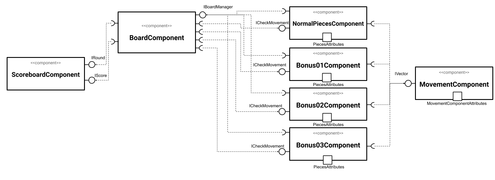

# Projeto Bitcrush

# Descrição Resumida do Projeto/Jogo

Bitcrush é um jogo de puzzle baseado em Candy Crush, o jogo consiste em trocar duas peças de lugar no tabuleiro para criar combinações de 3 ou mais peças do mesmo tipo.

# Equipe
* Thaina Milene de Oliveira - 244570

# Vídeos do Projeto

## Vídeo da Prévia
[vídeo da prévia](https://drive.google.com/file/d/1cZREXR3dypyyvbGZF23Ii20eB0uwlEGt/view?usp=sharing)

## Vídeo do Jogo
[vídeo do jogo]
> <Coloque um link para o vídeo em que é demonstrada a versão final do jogo. Esse vídeo deve ter em torno de 5 minutos. Este vídeo não apresenta slides, nem substitui a apresentação final do projeto, que será feita por conferência. Ele mostra apenas o jogo em funcionamento.>

# Slides do Projeto

## Slides da Prévia
[slides da prévia](https://docs.google.com/presentation/d/1AGrgW_72BtfeeAorsiIWryYgMXez1P_BmrZlbxnDQlE/edit?usp=sharing)

## Slides da Apresentação Final
[slides finais]`<Coloque um link para os slides da apresentação final do projeto.>`

## Relatório de Evolução

> <Relatório de evolução, descrevendo as evoluções do design do projeto, dificuldades enfrentadas, mudanças de rumo, melhorias e lições aprendidas. Referências aos diagramas e recortes de mudanças são bem-vindos.>

# Destaques de Código

~~~java
 public boolean verifyMovement(int target) {

        moves[0] = new MovementComponent();
        moves[1] = new MovementComponent();
        if ((index - board[target].getIndex()) * (index - board[target].getIndex()) == 1) { // pecas movendo na mesma linha
            if (type == getPieceOnTop(target) && type == getPieceOnTop(target - 9)) {
                moves[0].setV(true);
                moves[0].setMoveType('c');
                moves[0].addVct(target);
                moves[0].addVct(target - 9);
                moves[0].addVct(target - 18);
                if (type == getPieceInBottom(target)) {
                    moves[0].setMoveType('1');
                    moves[0].addVct(target + 9);
                }
            }
            if (type == getPieceInBottom(target) && type == getPieceInBottom(target + 9)) {
                if (moves[0].isV()) {
                    moves[0].setMoveType('b');
                    moves[0].addVct(target + 18);
                } else {
                    moves[0].setV(true);
                    moves[0].setMoveType('c');
                    moves[0].addVct(target);
                    moves[0].addVct(target + 9);
                    moves[0].addVct(target + 18);
                    if (type == getPieceOnTop(target)) {
                        moves[0].setMoveType('1');
                        moves[0].addVct(target - 9);
                    }
                }
            } else if (!moves[0].isV() && type == getPieceOnTop(target) && type == getPieceInBottom(target)) {
                moves[0].setV(true);
                moves[0].setMoveType('c');
                moves[0].addVct(target);
                moves[0].addVct(target + 9);
                moves[0].addVct(target - 9);
            }
            if (moves[0].getMovetype() != 'b') {
                if (type == getPieceInRight(target) && type == getPieceInRight(target + 1)) {
                    if (moves[0].getMovetype() == '1') {
                        moves[0].removeVct();
                    }
                    if (moves[0].isV()) {
                        moves[0].setMoveType('2');
                    } else {
                        moves[0].setV(true);
                        moves[0].setMoveType('l');
                        moves[0].addVct(target);
                    }
                    moves[0].addVct(target + 1);
                    moves[0].addVct(target + 2);
                }
            }
        }

        ...
}
~~~

# Destaques de Pattern
`<Destaque de patterns adotados pela equipe. Sugestão de estrutura:>`

## Diagrama do Pattern
`<Diagrama do pattern dentro do contexto da aplicação.>`

## Código do Pattern
~~~java
// Recorte do código do pattern seguindo as mesmas diretrizes de outros destaques
public void algoInteressante(…) {
   …
   trechoInteressante = 100;
}
~~~

> <Explicação de como o pattern foi adotado e quais suas vantagens, referenciando o diagrama.>

# Documentação dos Componentes

# Diagramas

## Diagrama Geral do Projeto

O usuário clica em duas peças no tabuleiro, que enviam os dados para serem traduzidos, e devolve ao tabuleiro que pede a peça para verificar o movimento, enviando os dados destes para Movement que guarda as informações do movimento e depois as enviam para o tabuleiro atualizar a tela.

## Diagrama Geral de Componentes

## Componente BoardComponent

O BoardComponent fornece um tabuleiro 9x9, onde serão colocadas peças e toda a função de manipulação destas serão feitas por ele.

**Ficha Técnica**
item | detalhamento
----- | -----
Classe | BoardComponent
Autores | Thaina Milene de Oliveira
Interfaces | IBoard

### Interfaces

Interfaces associadas a esse componente:

## Detalhamento das Interfaces

### Interface IBoard

É responsável por toda a comunicação necessária entre as peças e o tabuleiro.

~~~java
public interface IBoard {
    void translate(int position) throws InvalidPlay;
    IPieces[] getBoard();
}
~~~

Método | Objetivo
-------| --------
translate | Reconhece o index das peças clicadas, e envia para uma interface do tipo ITranslateMovimentC para criar um objeto que guarda os movimentos.
getBoard | Retorna o atributo board, que guarda as peças

## Componente NormalPiecesComponent

O NormalPiecesComponent fornece peças normais, sendo nove tipos diferentes, cuja quantidade de peças distintas variam de acordo com o nível que o usuário escolher.

**Ficha Técnica**
item | detalhamento
----- | -----
Classe | NormalPiecesComponent
Autores | Thaina Milene de Oliveira
Interfaces | ICheckMovement, PiecesAttributes, ActionListener

### Interfaces

Interfaces associadas a esse componente:

Interface agregadora do componente em Java:

~~~java
public interface IPieces extends ICheckMovement, PiecesAttributes, ActionListener {
}
~~~

## Detalhamento das Interfaces

### Interface ICheckMoviment

É responsável por verificar se o movimento é válido.

~~~java
        moves[0] = new MovementComponent();
        moves[1] = new MovementComponent();
        if ((index - board[target].getIndex()) * (index - board[target].getIndex()) == 1) { // pecas movendo na mesma linha
            if (type == getPieceOnTop(target) && type == getPieceOnTop(target - 9)) {
                moves[0].setV(true);
                moves[0].setMoveType('c');
                moves[0].addVct(target);
                moves[0].addVct(target - 9);
                moves[0].addVct(target - 18);
                if (type == getPieceInBottom(target)) {
                    moves[0].setMoveType('1');
                    moves[0].addVct(target + 9);
                }
            }
            if (type == getPieceInBottom(target) && type == getPieceInBottom(target + 9)) {
                if (moves[0].isV()) {
                    moves[0].setMoveType('b');
                    moves[0].addVct(target + 18);
                } else {
                    moves[0].setV(true);
public interface ICheckMovement {
    boolean verifyMovement(int target) throws InvalidPlay;
}
~~~

Método | Objetivo
-------| --------
verifyMovement | recebe como parâmetro a posição da segunda peça clicada, e compara com a posição da própria peça, verificando se o movimento é válido.

### Interface PiecesAttributes

Dá acesso aos atributos das peças.

~~~java
public interface PiecesAttributes {
    void setType(int x);
    char getType();
    int getX();
    IMovement[] getMoves();
    void setIndex(int index);
    int getIndex();
    void setBoard(IBoard Board);
    JButton getButton();
}
~~~

Método | Objetivo
-------| --------
setType | recebe como parâmetro um número inteiro e a partir dele define o tipo da peça
getType | retorna o tipo da peça
getX | retorna o número inteiro que foi usado para definir o tipo da peça
getMoves | retorna o objeto com as informações sobre o movimento de cada jogada
setIndex | guarda o índice da peça no tabuleiro
getBoard | retorna o índice da peça no tabuleiro
getButton | retorna o botão associado a peça

## Componente Bonus01Component

O Bonus01Component fornece peças do tipo bonus01.

**Ficha Técnica**
item | detalhamento
----- | -----
Classe | Bonus01Component
Autores | Thaina Milene de Oliveira
Interfaces | ICheckMovement, PiecesAttributes, ActionListener

### Interfaces

Interfaces associadas a esse componente:

Interface agregadora do componente em Java:

~~~java
public interface IPieces extends ICheckMovement, PiecesAttributes, ActionListener {
}
~~~

## Detalhamento das Interfaces

### Interface ICheckMoviment

É responsável por verificar se o movimento é válido.

~~~java
public interface ICheckMovement {
    boolean verifyMovement(int target) throws InvalidPlay;
}
~~~

Método | Objetivo
-------| --------
verifyMovement | recebe como parâmetro a posição da segunda peça clicada, e compara com a posição da própria peça, verificando se o movimento é válido.

### Interface PiecesAttributes

Dá acesso aos atributos das peças.

~~~java
public interface PiecesAttributes {
    void setType(int x);
    char getType();
    int getX();
    IMovement[] getMoves();
    void setIndex(int index);
    int getIndex();
    void setBoard(IBoard Board);
    JButton getButton();
}
~~~

Método | Objetivo
-------| --------
setType | recebe como parâmetro um número inteiro e a partir dele define o tipo da peça
getType | retorna o tipo da peça
getX | retorna o número inteiro que foi usado para definir o tipo da peça
getMoves | retorna o objeto com as informações sobre o movimento de cada jogada
setIndex | guarda o índice da peça no tabuleiro
getBoard | retorna o índice da peça no tabuleiro
getButton | retorna o botão associado a peça

## Componente Bonus02Component

O Bonus02Component fornece peças do tipo bonus01.

**Ficha Técnica**
item | detalhamento
----- | -----
Classe | Bonus02Component
Autores | Thaina Milene de Oliveira
Interfaces | ICheckMovement, PiecesAttributes, ActionListener

### Interfaces

Interfaces associadas a esse componente:

Interface agregadora do componente em Java:

~~~java
public interface IPieces extends ICheckMovement, PiecesAttributes, ActionListener {
}
~~~

## Detalhamento das Interfaces

### Interface ICheckMoviment

É responsável por verificar se o movimento é válido.

~~~java
public interface ICheckMovement {
    boolean verifyMovement(int target) throws InvalidPlay;
}
~~~

Método | Objetivo
-------| --------
verifyMovement | recebe como parâmetro a posição da segunda peça clicada, e compara com a posição da própria peça, verificando se o movimento é válido.

### Interface PiecesAttributes

Dá acesso aos atributos das peças.

~~~java
public interface PiecesAttributes {
    void setType(int x);
    char getType();
    int getX();
    IMovement[] getMoves();
    void setIndex(int index);
    int getIndex();
    void setBoard(IBoard Board);
    JButton getButton();
}
~~~

Método | Objetivo
-------| --------
setType | recebe como parâmetro um número inteiro e a partir dele define o tipo da peça
getType | retorna o tipo da peça
getX | retorna o número inteiro que foi usado para definir o tipo da peça
getMoves | retorna o objeto com as informações sobre o movimento de cada jogada
setIndex | guarda o índice da peça no tabuleiro
getBoard | retorna o índice da peça no tabuleiro
getButton | retorna o botão associado a peça

## Componente Bonus03Component

O Bonus03Component fornece peças do tipo bonus01.

**Ficha Técnica**
item | detalhamento
----- | -----
Classe | Bonus03Component
Autores | Thaina Milene de Oliveira
Interfaces | ICheckMovement, PiecesAttributes, ActionListener

### Interfaces

Interfaces associadas a esse componente:

Interface agregadora do componente em Java:

~~~java
public interface IPieces extends ICheckMovement, PiecesAttributes, ActionListener {
}
~~~

## Detalhamento das Interfaces

### Interface ICheckMoviment

É responsável por verificar se o movimento é válido.

~~~java
public interface ICheckMovement {
    boolean verifyMovement(int target) throws InvalidPlay;
}
~~~

Método | Objetivo
-------| --------
verifyMovement | recebe como parâmetro a posição da segunda peça clicada, e compara com a posição da própria peça, verificando se o movimento é válido.

### Interface PiecesAttributes

Dá acesso aos atributos das peças.

~~~java
public interface PiecesAttributes {
    void setType(int x);
    char getType();
    int getX();
    IMovement[] getMoves();
    void setIndex(int index);
    int getIndex();
    void setBoard(IBoard Board);
    JButton getButton();
}
~~~

Método | Objetivo
-------| --------
setType | recebe como parâmetro um número inteiro e a partir dele define o tipo da peça
getType | retorna o tipo da peça
getX | retorna o número inteiro que foi usado para definir o tipo da peça
getMoves | retorna o objeto com as informações sobre o movimento de cada jogada
setIndex | guarda o índice da peça no tabuleiro
getBoard | retorna o índice da peça no tabuleiro
getButton | retorna o botão associado a peça

## Componente ScoreboardComponent

O ScoreboardComponent é responsável pelo placar e contador de rodadas do jogo, além de verificar ao final, se o jogador ganhou ou perdeu, e encerrando o jogo.

**Ficha Técnica**
item | detalhamento
----- | -----
Classe | ScoreboardComponent
Autores | Thaina Milene de Oliveira
Interfaces | IRound, IScore, ActionListener

### Interfaces

Interfaces associadas a esse componente:

Interface agregadora do componente em Java:

~~~java
public interface IScoreboard extends IScore, IRound, ActionListener {
}
~~~

## Detalhamento das Interfaces

### Interface IScore

É responsável por atualizar o placar do jogo.

~~~java
public interface IScore {
    void sumScore(int n);
}
~~~

Método | Objetivo
-------| --------
sumScore | recebe como parâmetro a pontuação a ser somada ao placar e a soma

### Interface IRound

É responsável por atualizar o contador de rodadas

~~~java
public interface IRound {
    void sumRound();
}
~~~

Método | Objetivo
-------| --------
sumRound | soma mais um na rodada

## Componente MovementComponent

O MovementComponent é responsável por guardar as informações da rodada, como se ela é válida, o tipo de movimento, quais peças serão eliminadas.

**Ficha Técnica**
item | detalhamento
----- | -----
Classe | MovementComponent
Autores | Thaina Milene de Oliveira
Interfaces | MovementComponentAttributes, IVector

### Interfaces

Interfaces associadas a esse componente:

Interface agregadora do componente em Java:

~~~java
public interface IMovement extends MovementComponentAttributes, IVector {
}
~~~

## Detalhamento das Interfaces

### Interface MovementComponentAttributes

Dá acesso aos atributos da classe.

~~~java
public interface MovementComponentAttributes {

    void setMoveType(char moveType);
    void setV(boolean v);
    char getMovetype();
    int[] getVct();
    boolean isV();

}
~~~

Método | Objetivo
-------| --------
setMoveType | recebe como parâmetro um char que representa o tipo de movimento que a rodada gerará.
setV | recebe como parametro um boolean que define a jogada como possível pu não possível
getMovetype | retorna o tipo de movimento
getVct | retorna um vetor com as peças a serem eliminadas
isV() | retorna se a jogada é verdadeira ou falsa

### Interface IVector

É responsável por manipular o vetor contendo as peças a serem eliminadas

~~~java
public interface IVector {
    void addVct(int index);
    void removeVct();
}
~~~

Método | Objetivo
-------| --------
addVct | adiciona um índice ao vetor, na posição que o contador estivel
removeVct() | faz um contador voltar uma posição, para assim o último elemento ser sobrescrito por outro

## Componente TranslateMovementComponent

O TranslateMovementComponent é responsável por traduzir e guardar em um objeto os índices das peças trocadas.

**Ficha Técnica**
item | detalhamento
----- | -----
Classe | TranslateMovementComponent
Autores | Thaina Milene de Oliveira
Interfaces | ITranslateMovementC

### Interfaces

Interfaces associadas a esse componente:

## Detalhamento da Interface

### Interface ITranslateMovementC

Dá acesso aos atributos da classe.

~~~java
public interface ITranslateMovementC {
    int getSource();
    int getTarget();
    void setTarget(int target) throws NonAdjacentPieces;
    void setSource(int source);
}
~~~

Método | Objetivo
-------| --------
setSource | recebe como parâmetro um inteiro que representa a posição da primeira peça clicada
setTarget | recebe como parâmetro um inteiro que representa a posição da segunda peça clicada
getSource| retorna a posição da primeira peça
getTarget| retorna a posição da segunda peça

# Plano de Exceções1

## Diagrama da hierarquia de exceções

## Descrição das classes de exceção

Classe | Descrição
----- | -----
InvalidPlay | Engloba todas as exceções de jogadas não aceitas.
NonAdjacentPieces | Indica que foi clicado duas peças não adjacentes.
UselessMovement | Indica que o movimento não gera uma jogada válida
