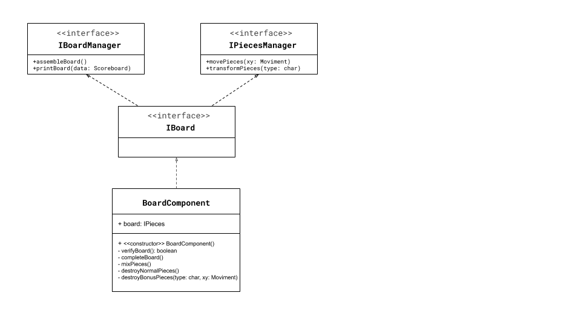

# Projeto Bitcrush

# Equipe
* Thaina Milene de Oliveira - 244570

# Descrição Resumida do Projeto
O BitCrush é um jogo que consiste em trocar duas peças de lugar no tabuleiro para criar combinações de 3 ou mais peças do mesmo tipo.

# Vídeo do Projeto
[Link do vídeo](https://drive.google.com/file/d/1cZREXR3dypyyvbGZF23Ii20eB0uwlEGt/view?usp=sharing)

# Diagrama Geral de Componentes

# Componente BoardComponent

## Interfaces

Interfaces associadas a esse componente:

Campo | Valor
----- | -----
Classe | `<caminho completo da classe com pacotes>`   Exemplo: `pt.c08componentes.s20catalog.s10ds.DataSetComponent`
Autores | Thaina Milene de Oliveira
Objetivo | Criar e manipular o tabuleiro
Interface | IBoard
~~~
public interface IBoardManager {
  public void assembleBoard();
  public void printBoard();
}
public interface IPiecesManager {
  public void movePieces(MovimentComponent xy);
  public void transformsPieces(char type);
}
public interface IBoard extends IBoardManager, IPiecesManager {
}
~~~

## Detalhamento das Interfaces

### Interface IBoardManager
Interface para gerenciar as ações feitas no tabuleiro.

Método | Objetivo
-------| --------
public void assembleBoard(); | tem como objetivo montar um tabuleiro inicial com peças aleatórias
public void printBoard(Scoreboard data); | tem como objetivo imprimir o tabuleiro e a pontuação e rodada atual

### Interface IPiecesManager
Interface para gerenciar as ações feitas pelo tabuleiro nas peças.

Método | Objetivo
-------| --------
public void movePieces(MovimentComponent xy) | dado as coordenadas fornecidas pelo componente MovimentComponent, o tabuleiro trocará duas peças, se for um movimento válido
public void transformsPieces(char type); | transforma peças de um tipo normal, em um bonus